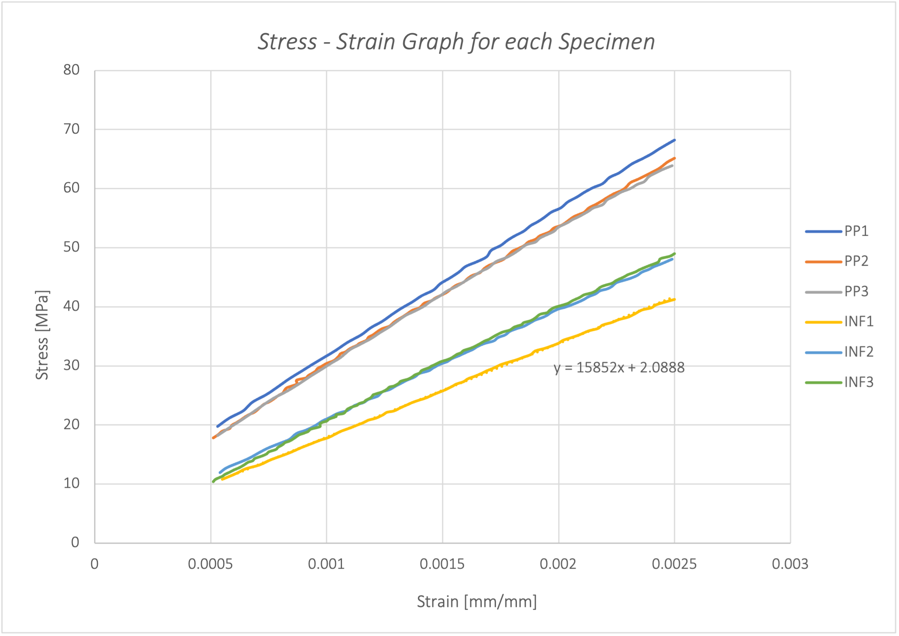
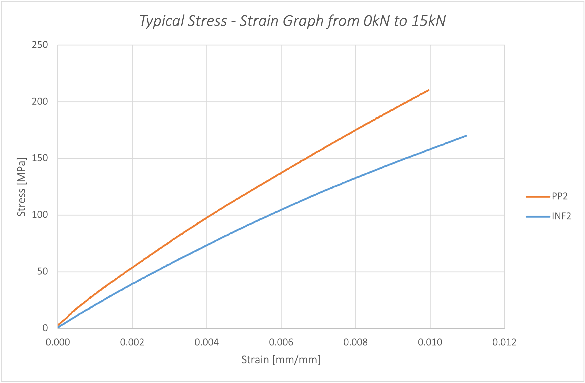
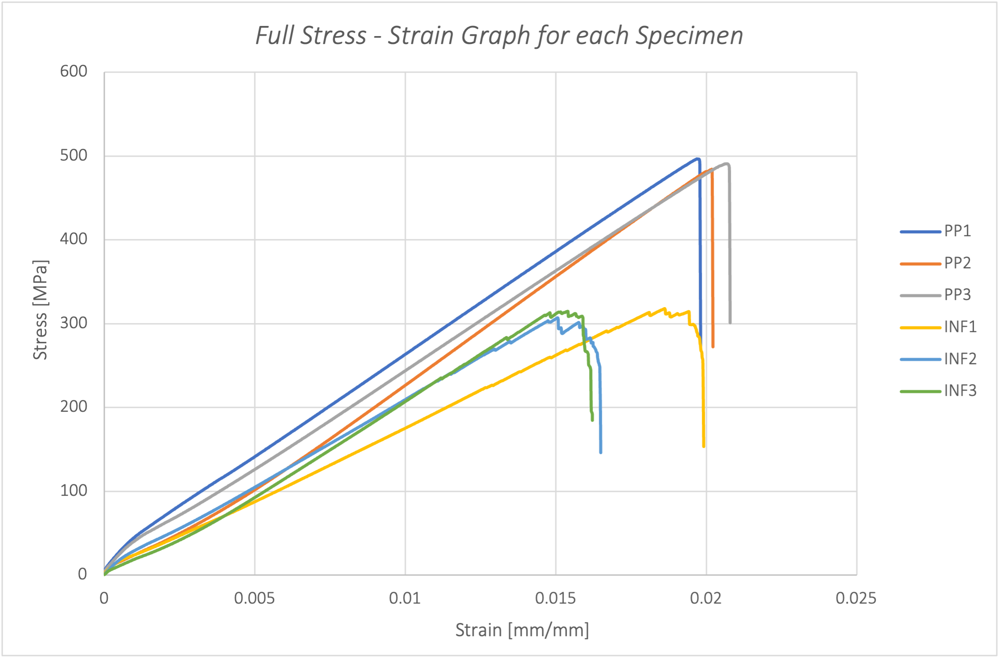

# Composite Materials Analysis and Tensile Testing

This repository contains a comprehensive analysis of composite materials, focusing on tensile properties derived from experimental testing and theoretical predictions. The work incorporates data visualization, calculations, and a detailed report on discrepancies between experimental and theoretical results.

## Overview

The project involves:
- **Tensile Testing**: Experimentally determining the tensile properties of pre-preg and resin-infused composite laminates.
- **Theoretical Predictions**: Utilizing the **Classical Laminate Plate Theory (CLPT)** to predict engineering properties.
- **Comparison**: Evaluating discrepancies between experimental and theoretical results.
- **Data Analysis**: Visualizing stress-strain relationships and analyzing key metrics such as Young's Modulus (Ex), tensile strength (Xt), and strain (εtx).

---

## Repository Contents

- **`CW2 - Calculate Xt and Strain.ipynb`**: Jupyter Notebook for detailed analysis and calculations.
- **`cw2.py`**: Python script for computations related to tensile properties.
- **`TensionData.xlsx`**: Experimental data file containing stress-strain values.
- **`SESG6039 – Composites CW2 - Abhinandan Thour.pdf`**: Report detailing methodology, results, and insights.
- **`Individual Assignment 2 - (2023).pdf`**: Assignment brief and requirements.

---

## Key Visualizations

### 1. Stress-Strain Relationship
**Figure 1**: Stress-Strain graph comparing the tensile behavior of pre-preg and resin-infused laminates until failure.



### 2. Stress-Strain Graph (0-15 kN Range)
**Figure 2**: Highlighting material behavior in the initial elastic region.



### 3. Comparison Between Theoretical and Experimental Values
**Figure 3**: Discrepancies between theoretical (CLPT) and experimental results.



---

## Experimental Setup

The tensile tests followed the **BS EN ISO 527-5:1997** standard:
- **Materials**: Pre-preg and resin-infused laminates with [-45, +45, 90, 0, 90, 0]s layup.
- **Equipment**: Electro-mechanical Instron 5500 with a 50 mm extensometer.
- **Procedure**:
  1. Measure dimensions at three locations along the specimen.
  2. Mount the specimen on the test machine.
  3. Apply tensile load at 5 mm/min until failure.
  4. Collect data on load, displacement, and strain.

### Observations
- Pre-preg specimens exhibited brittle failure, higher stiffness, and consistent behavior due to precise resin content.
- Resin-infused laminates showed ductile failure with greater elasticity, attributed to potential voids and uneven resin distribution.

---

## Methodology

### Data Analysis
- Stress calculated as load divided by cross-sectional area.
- Young's Modulus (Ex) determined from the slope of the linear region.
- Failure stress (Xt) and strain (εtx) derived from maximum load points.

### CLPT Predictions
Using ply thickness and stacking sequences, theoretical values for Ex and Ey were computed. The analysis showed deviations due to factors like void content, resin distribution, and fiber alignment.

---

## Results

| Specimen Type | Ex (MPa) - Experimental | Ex (MPa) - CLPT | Error (%) |
|---------------|--------------------------|------------------|-----------|
| Pre-Preg      | 24,688                  | 22,557           | 9.45      |
| Resin-Infused | 15,852                  | 20,824           | 23.88     |

- The **Pre-preg process** demonstrated higher stiffness and less variability.
- The **Resin Infusion process** showed higher ductility but lower tensile properties.

---

## Recommendations

- Use **Pre-preg composites** for applications requiring high stiffness and consistency.
- Address void content in resin-infused laminates to improve mechanical properties.
- Conduct further studies on fiber alignment and resin flow optimization during manufacturing.

---

## How to Run

1. **Clone the Repository**:
   ```bash
   git clone https://github.com/Bh00fie/CW2-Composites.git
   cd CW2-Composites
